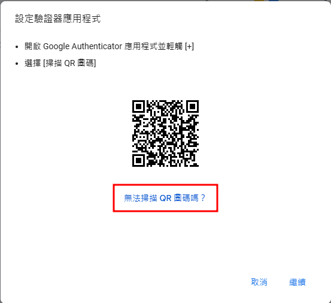

# 2024/11/06

資安研習

---

## 大綱

- 使用 7-Zip 加解密壓縮檔
- 如何更安全的使用 Google 雲端硬碟
  - 離線存取
  - 使用 Cryptomator 保護機敏資料
  - 使用密碼工具管理密碼

---

## 使用 7-Zip 加解密壓縮檔

----

### 關於 7-Zip

- https://www.7-zip.org/
- [繁體中文版官方網站](https://www.developershome.com/7-zip/)
- 自由軟體
- 一直按下一步就可以安裝完成

----

### 選取檔案按右鍵

----

### 新增壓縮檔

----

### 建立有密碼的 zip 壓縮檔

----

### 解壓縮有密碼的壓縮檔

----

### 輸入密碼完成解壓縮

---

## 離線存取 Google 雲端硬碟的檔案

----

### 雲朵和綠勾勾的差異

----

### 雲朵和綠勾勾的差異 (cont.)

- Translate 目錄占用 20G
- vaults 目錄占用 5G
- 請問一共吃了硬碟多少空間？

----

### 雲朵和綠勾勾的差異 (cont.)

- 網路斷線中
- 請問哪個目錄的檔案還可存取？

----

### 如何設定目錄/檔案可離線存取？

---

## 使用 Cryptomator  保護機敏資料

----

### 關於 Cryptomator

- https://cryptomator.org/
- 自由軟體
- 一直按下一步就可以安裝完成

----

### 先建立 vaults 目錄

- 記得設定離線存取

----

### 建立第一個 vault

----

### 根據用途為 vault 取名

----

### 設定 vault 路徑

----

### 按下一步

----

### 設定 vault 密碼

- 這邊的第 3 步選擇不產生救援密碼
- 如果你怕忘記那就選另一個選項並保存之

### 解鎖 vault 開始使用

----

### 輸入正確密碼完成解鎖

----

### 打開檔案總管顯示解鎖的 vault 位置

----

### 可安心存放機敏資料

- 不一定每次都是 F:
- 也可以根據需求建立多個 vaults 解鎖使用

----

### 使用結束記得鎖上 vault

----

### 按下 Unlock 可解鎖再次使用

----

### 架構示意圖

----

### 練習介接已存在的 vault

1. 按右鍵刪除剛剛建立的 work vault
   - 這裡的刪除只是讓 cryptomator 忘記此設定
   - 檔案不會被刪除
2. Add -> Existing Vault
   - 會提示你要找到 ``vault.cryptomator`` 檔案

---

## 使用密碼管理工具管理密碼

----

### 管理密碼最佳原則

- 長度越長越好（？）
- 包含大小寫英文數字特殊符號（？？）
- 每個網站都設定不同密碼（？？？）

----

----

### 必須使用密碼管理軟體

- 用瀏覽器內建的
- 或找獨立的密碼管理軟體

----

### 先啟用 Google Chrome 的帳號同步

- 公用電腦記得離開前登出自己帳號

----

### 進入Google Chrome 密碼管理工具

----

### 啟用密碼同步至 Google 帳號並搬移紀錄

----

### 這樣你也可以透過 Google 帳戶網頁管理帳密

----

### 以後註冊網站帳號都用隨機密碼

----

### Google Chrome 密碼管理工具介面

----

### 密碼管理如果做到這邊

- 已經算做得很不錯了
- 前提是 Google 是可以信任的

----

### 但認真說起來，我們不該相信商業公司

- Microsoft 的[擁抱、擴充再消滅](https://zh.wikipedia.org/zh-tw/%E4%B8%87%E5%9C%A3%E8%8A%82%E6%96%87%E4%BB%B6)
- [Google 的阻擋擋廣告外掛行為](https://blog.gslin.org/archives/2019/05/30/9023/%e6%89%80%e4%bb%a5-google-%e8%a6%81%e5%b0%8d-ad-blocker-%e5%85%a8%e9%9d%a2%e5%ae%a3%e6%88%b0%e4%ba%86/)
- [Apple 壟斷及反競爭行動的指控](https://zh.wikipedia.org/zh-tw/%E8%8B%B9%E6%9E%9C%E5%85%AC%E5%8F%B8%E7%9B%B8%E5%85%B3%E4%BA%89%E8%AE%AE#%E5%9E%84%E6%96%AD%E5%8F%8A%E5%8F%8D%E7%AB%9E%E4%BA%89%E8%A1%8C%E5%8A%A8%E7%9A%84%E6%8C%87%E6%8E%A7)
- [Facebook 隱私權爭議](https://zh.wikipedia.org/zh-tw/%E5%B0%8DFacebook%E7%9A%84%E6%89%B9%E8%A9%95#%E9%9A%90%E7%A7%81%E6%9D%83%E4%BA%89%E8%AE%AE)

----

### 駭客任務 - 電腦將人類當成電池橋段

<iframe width="560" height="315" src="https://www.youtube.com/embed/O5b0ZxUWNf0?si=d_EWE1HVUkgjdBtA" title="YouTube video player" frameborder="0" allow="accelerometer; autoplay; clipboard-write; encrypted-media; gyroscope; picture-in-picture; web-share" referrerpolicy="strict-origin-when-cross-origin" allowfullscreen></iframe>

----

### 所以推薦使用 KeePass* 系列 密碼管理軟體

- 開源、免費
- 不受任何商業公司控制
- 可拿來存放信用卡資料、證件照等機敏資料
- 支援 TOTP 驗證碼設定

----

### TOTP?

Live Demo

----

### 講到這邊

- 覺得用 Google Chrome 的密碼管理工具就可以的人，可以離開了。
- 後面都是介紹 KeePassXC 的操作

----

### 軟體下載點

- MacOS / Windows
  - [KeePassXC](https://keepassxc.org/) <-- 今天都是示範這個
- Android
  - [Keepass2Android Password Safe](https://play.google.com/store/apps/details?id=keepass2android.keepass2android&hl=zh_TW&pli=1)
- Apple iOS / iPadOS
  - [KeePassium](https://apps.apple.com/tw/app/keepassium-%E5%AF%86%E7%A2%BC%E7%AE%A1%E7%90%86%E5%99%A8-keepass/id1435127111)

----

### KeePassXC

- [下載點](https://keepassxc.org/download/)
- 安裝完如果不能啟動請重裝 [MSVC](https://aka.ms/vs/17/release/vc_redist.x64.exe)

----

### 第一次啟動 KeePassXC

- 建立資料庫檔案

 <!-- .element height="70%" width="70%" -->

----

### 幫資料庫取名

 <!-- .element height="80%" width="80%" -->

----

### 設定加密選項

- 把握一個原則：看不懂就用預設值

 <!-- .element height="70%" width="70%" -->

----

### 設定資料庫的密碼

- 越長越好越亂越好，最好加上特殊字元
  - ex. 使用英數模式輸入 ``濱江國小地表最強$$``
- 你唯一需要記住的密碼

 <!-- .element height="50%" width="50%" -->

----

### 指定資料庫位置

- 可以放在前面建立的 vaults 目錄下

----

### 新增第一筆紀錄

 <!-- .element height="70%" width="70%" -->

----

### 使用搜尋找尋帳密

 <!-- .element height="70%" width="70%" -->

----

### 設定 Google 帳號的 TOTP

----

### 設定驗證器

----

### 改用手動新增

----

### 複製金鑰

----

### 設定金鑰

----

### 完成設定

----

### 如何確認是否有 TOTP

 <!-- .element height="70%" width="70%" -->

----

### 繼續未完成的設定

----

### 最後驗證步驟

----

### 完成新增驗證器步驟

----

### 可附加資訊或檔案

----

### KeePassXC 介紹先到這

- 上次介紹後有人有一直用到現在嗎？
- 有的話可以開進階課程
  - 瀏覽器外掛
  - Passkey

---

## Thank you for listening