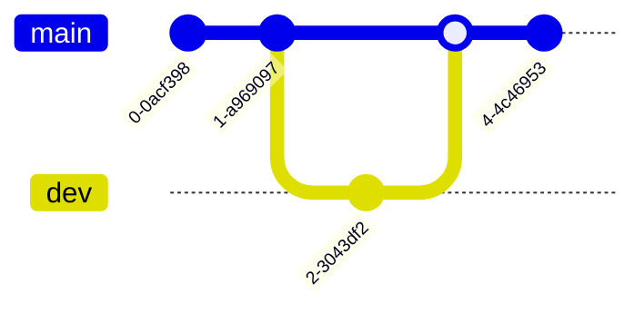

# 簡介

## 什麼是 reveal.js

- [官網](https://revealjs.com/)
- 是一種投影片框架，特別適合用來撰寫技術相關的投影片。
- [需撰寫 html 語法](https://revealjs.com/markup/)，語法稍嫌麻煩也不利於版控。

----

## 什麼是 Markdown

- 一種易讀易寫的格式，特別適用於程式碼相關的技術內容。
- 臺灣有熱血開發者弄了一個[介紹 Markdown 語法](https://markdown.tw)的網站。

----

## 什麼是 reveal-md 專案

- reveal.js 內建有支援 Markdown 語法，但撰寫的方式有點麻煩，且不利於一般編輯器對 Markdown 語法上色的支援。
- 於是 [reveal-md](https://github.com/webpro/reveal-md) 專案誕生。你可以直接撰寫 Markdown 語法，由 reveal-md 自動幫你產生投影片內容。

# 安裝

## 安裝 nodejs

到 [nodejs 官方下載點](https://nodejs.org/en/download/prebuilt-binaries)下載編譯好的二進位執行檔：

```bash
wget https://nodejs.org/dist/v20.18.0/node-v20.18.0-linux-x64.tar.xz
tar Jxvf node-v20.18.0-linux-x64.tar.xz
# 習慣上我會建立一個 ~/Programs 資料夾把一些抓下來的執行檔都丟到這個目錄
mv node-v20.18.0-linux-x64 Programs/
# 路徑設定記得丟到 ~/.bash_profile 之類的地方，每次登入時才會吃到設定
export PATH=~/Programs/node-v20.18.0-linux-x64/bin:$PATH
```

## 更新 npm 版本

這步驟不做也可以，只是我習慣把 npm 都更新到最新版。

```bash
npm install -g npm
```

## 安裝 reveal-md 套件

```bash
npm install -g reveal-md
```

## 如何執行 reveal-md 以顯示投影片

先寫個簡單的簡報檔案，檔名取為 hello-reveal.md，內容如下：

```markdown
# 這是投影片標題

這一頁是投影片標題

---

## 第一頁

每一頁都是用 \n---\n 作為分隔符號

---

## 第二頁

這是第二頁

```

執行以下指令，reveal-md 就會開啟瀏覽器顯示你的投影片內容：

```bash
reveal-md hello-reveal.md
```

# 語法與功能說明

## 常用操作：

* 按下 ``ESC`` 或 ``O`` 可總覽所有投影片
* 按下 ``F`` 進入全螢幕，``ESC``離開全螢幕
* ```方向鍵```控制投影片播放
* 按下 ``ALT`` 不放，用滑鼠點選投影片特定位置可局部放大，再點一次復原。

## 水平投影片 (Horizontal Slides) 

預設使用 ``\n---\n`` 作為分隔依據：

```markdown
# 這是第一頁

---

# 這是第二頁
```

## 垂直投影片 (Vertical Slides)

預設使用 ``\n----\n`` 作為分隔依據：

```markdown
# 這是第一頁

----

# 這是垂直第一頁
```

## 語法上色與畫圖 (Syntax Highlight & Graph)

畫圖的部分使用的是 [Mermaid](https://mermaid.js.org/) 這套畫圖工具，可以用純文字畫出需要的圖示或流程圖。範例可參考 https://mermaid.js.org/intro/ 。

````markdown
上色 Python 程式碼片段：

```python
print('hello world')
```

針對特定行上色語法，並可依序高亮顯示：
```python [1|3-6]
n = 0
while n < 100:
  if n % 2 != 0:
    print(f"{n} is odd")
  else:
    print(f"{n} is even")
  n += 1
```

產生 mermaid 圖


````

## 演講者備註 (Speaker Notes)

使用 ``Notes:`` 撰寫演講者備註，預設不會顯示在觀眾看的到的投影片裡面。若要啟用演講者備註的功能，可以打開投影片後按下 ``s`` 啟用。範例如下：

```markdown
# 這是第一頁

這是第一頁內容

Notes: 這是演講者備註，不會顯示在觀眾看的到的投影片上。

---

# 這是第二頁

這是第二頁的內容

Notes:

也可以寫在第二行，

可以有空白行。
```

## Fragments 與背景圖案支援

```markdown
# fragments 範例

* 先出現這行 <!-- .element class="fragment" -->
* 再出現這行 <!-- .element class="fragment" -->

---

<!-- .slide: data-background="./image1.png" -->

# 背景圖範例

這一頁會有背景圖
```

詳細說明可參考：
* https://revealjs.com/markdown/#element-attributes
* https://revealjs.com/markdown/#slide-attributes

## 佈景主題 (Themes)

[這裡](https://github.com/hakimel/reveal.js/tree/master/css/theme/source)有內建的佈景主題列表，比方要使用 dracula 佈景主題：

```bash
reveal-md hello-reveal.md --theme dracula
```

## 輸出

### 輸出成 pdf

雖然文件上說可以用

```bash
reveal-md hello-reveal.md --print hello-reveal.pdf --disable-auto-open
```

輸出成 pdf，但實測發現中文字會變成方塊，可能還得去找處理中文字型的方法。

所以比較簡單的方式是用 Chrome 系的瀏覽器打開投影片，網址後面加上 ``?view=print`` 後，再用瀏覽器的輸出 pdf 功能把檔案存下來比較簡單。

### 輸出成靜態網站

``--static`` 後面可以指定輸出到哪個資料夾，預設是輸出到 ``_static`` 資料夾：
```bash
reveal-md hello-reveal.md --static _static --disable-auto-open
```